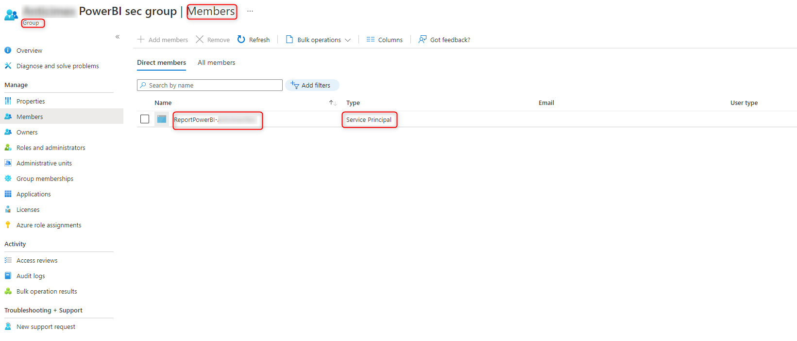

# BlazorPowerBI

Il progetto consiste in una semplice applicazione Blazor WebAssembly in grado di incorporare, direttamente all’interno di un componente Razor, un report di PowerBi senza far uso del tag iframe autogenerato dalla piattaforma di reportistica, ma bensì sfruttando le API messe a disposizione da quest’ultima. Questa soluzione consente di avere maggior controllo e pulizia del codice che viene incorporato all’interno del progetto.

## Architettura
L'architettura descritta nel diagramma sottostante si prefigge di descrivere il flusso di autenticazione e autorizzazione per accedere ai dati della risorsa del report PowerBI.
L'utente quando richiede di accedere al report di PowerBI, fa implicitamente una richiesta di accesso a una risorsa e successivamente richiede la risposta stessa.
L'applicazione Blazor client (WASM), necessita di un token per l'accesso a PowerBI. Fa quindi una richiesta al backend dove si potrà fare una richiesta via **Client Credential** ad Azure Active Directory alla risorsa PowerBI. Una volta ottenuto il token, questo viene usato da Blazor e in particolare dall'SDK javascript per accedere agli oggetti della risorsa ed eventualmente controllare il report PowerBI per impostare una serie di informazioni, quali filtri, gestione eventi etc.
1. Richiesta utente per la visualizzazione del report
2. richiesta dall'applicazione web al backend
3. richiesta dal backend ad Azure Active Directory per la richiesta di accesso alla risorsa
4. Restituzione del token al backend
5. Restituzione del token al frontend blazor
6. Richiesta del token la richiesta della risorsa
7. Ricezione token per accedere alla risorsa
8. restituzione di html e javascript con i dati


## Permessi e Autenticazione
Il seguente paragrafo è un breve riepilogo di come è stato impostato e configurato l’ambiente all’interno del quale andremo ad operare, partendo dal presupposto che vi sia un report di PowerBi già esistente.
#### Azure Active Directory
Grazie alle funzionalità offerte da Azure AD abbiamo la possibilità di centralizzare la gestione di autorizzazione e permessi che vogliamo fornire alla nostra applicazione. Per raggiungere tale scopo si è dunque operato nel seguente modo:
-	È stata creata una nuova registrazione associata all’app. Da qui è stato dunque creato un nuovo client secret, che in combinazione al tenant id e client id consentirà all’applicazione Blazor di autenticarsi. 
-	Dopo di che l’applicazione è stata autorizzata a chiamare le API esposte da PowerBi. 
-	In fine, è stato creato un gruppo, in modo tale da semplificare la gestione degli utenti. 

#### PowerBi
Lato PowerBi, invece, al fine di completare il giro di autenticazione, sono state eseguite le seguenti operazioni:
-	Dai Workspaces è stato selezionato il report che si desidera collegare all’applicazione e premuto il tasto Access.   
-	Nella schermata appena apertasi è stato aggiunto come amministratore il gruppo creato in precedenza.    

## Codice
Si andrà ora ad illustrare i passi fondamentali che sono stati affrontati durante l’implementazione dell’applicazione fino al raggiungimento del risultato desiderato.
Blazor ci permette di eseguire una parte del codice, generato a partire da quello C# definito da noi, direttamente all’interno del browser. La nostra soluzione è dunque divisa in due progetti: BlazorPowerBi.Server e BlazorPowerBi.Client, quest’ultimo sarà appunto la parte che verrà eseguita lato browser.

#### BlazorPowerBi.Server
Una volta creata la nuova applicazione Blazor WebAssembly, il primo passo è fare in modo che essa sia in grado di autenticarsi mediante Azure AD. Come già anticipato nel paragrafo precedente, per raggiungere tale scopo andremo ad utilizzare il client secret, il client id e il tenant id di Azure AD.  Aggiunti quindi in configurazione lato server i rispettivi parametri, andiamo a creare un nuovo controller PowerBiController utilizzarli al suo per recuperare un token valido da Azure Ad.
```cs
 [HttpGet]
 public async Task<IActionResult> Get()
 {
     var app = ConfidentialClientApplicationBuilder.Create(applicationOptions.ClientId)
         .WithTenantId(applicationOptions.TenantId)
         .WithClientSecret(applicationOptions.ClientSecret)
         .Build();

     var result = await app.AcquireTokenForClient(applicationOptions.Scopes)
         .ExecuteAsync();

     return Ok(new AuthApplicationResult
     {
         AccessToken = result.AccessToken,
         ExpiresOn = result.ExpiresOn,
         IdToken = result.IdToken
     });
 }
```

Sempre all’interno del controller andiamo a realizzare anche un metodo che restituisca al client le informazioni base relative al report che desideriamo recuperare da PowerBi, anche queste salvate in configurazione.
```cs
[HttpGet("config/{reportName}")]
public IActionResult GetReportConfig(string reportName)
{
     var report = reportOptions.Value.Reports.FirstOrDefault(t => t.ReportName == reportName);
     if (report == null)
         return NotFound();

     return Ok(new ReportConfiguration
     {
         Dataset = reportOptions.Value.Dataset,
         ReportId = report.ReportId,
         ReportDisplayName = report.ReportDisplayName,
         ReportName = report.ReportName
     });
}
```

#### BlazorPowerBi.Client
Spostandoci ora lato client, ciò che dobbiamo fare è recuperare tutte le informazioni relative al report e mostrarle all’interno di una pagina web. 

Continuando a procedere con ordine andiamo dunque subito a realizzare una pagina Razor che vada a richiamare il servizio PowerBi/config/{ReportName} esposto dal server. 

```cs
@if (Loading)
{
    <MudProgressCircular Color="Color.Primary" Size="Size.Large" Indeterminate="true" />
}
else
{
    <ReportComponent ReportOptions="@options" EmbedReportId="@embedReportId">
    </ReportComponent>
}

@code{
    [Parameter]
    public string ReportName { get; set; }
    private bool Loading { get; set; }

    private EmbeddedReportParameters options;
    private string embedReportId;
    private ReportConfiguration reportData;

    protected override async Task OnParametersSetAsync()
    {
        Loading = true;
        try
        {
            logger.LogInformation($"OnParametersSetAsync {ReportName}");
            await FillReportData();

            breadcrumbService.LoadBreadcrumb(new List<BreadcrumbItem>(1) {
                new BreadcrumbItem("Reports", href: null, disabled: true),
                new BreadcrumbItem(reportData.ReportDisplayName, href: $"/reports/show/{ReportName}", disabled: false)
            });
        }
        finally
        {
            Loading = false;
        }

    }
    
    private async Task FillReportData()
    {
        reportData = await client.GetFromJsonAsync<ReportConfiguration>($"PowerBI/config/{ReportName}");
        embedReportId = reportData.ReportId;	
        options = new EmbeddedReportParameters
        {
               Datasets = new Dataset[] { new Dataset() { Id = reportData.Dataset } },
               Reports = new Report[] { new Report() { AllowEdit = false, Id =  embedReportId} }
        };	
    }
}
```

Il componente Razor ComponentReport, che viene visualizzato all’interno della nostra pagina, avrà al suo interno un semplice div che farà da contenitore per il nostro report e svolgerà principalmente due funzioni principali:
-	Appena il componente viene inizializzato richiama il metodo del controller per recuperare il token da Azure Ad.
-	Una volta completato il proprio caricamento, invoca una funzione javascript denominata drawBi, alla quale verranno passati come parametri il token di Azure AD, l’id del report che desideriamo recuperare e le altre informazioni relative al DataSet.

```cs
<div id="embedContainer" style="height:85vh;margin-top:5px"></div>

@code {
    [Parameter]
    public EmbeddedReportParameters ReportOptions { get; set; }

    [Parameter]
    public string EmbedReportId { get; set; }

    private string accessTokenAAD = string.Empty;
    private string email = string.Empty;

    protected override async Task OnInitializedAsync()
    {
        try
        {
            var authResult = await Http.GetFromJsonAsync<AuthApplicationResult>("PowerBI");
            accessTokenAAD = authResult.AccessToken;
           
        }
        catch(Exception ex)
        {
            logger.LogError(ex, "OnInitializedAsync");
        }
    }

    protected override async Task OnAfterRenderAsync(bool firstRender)
    {
        try
        {
            if (!firstRender && !string.IsNullOrEmpty(accessTokenAAD))
            {
                await jsRuntime.InvokeVoidAsync("drawBi", accessTokenAAD, EmbedReportId, ReportOptions);
            }
        }
        catch(Exception ex)
        {
            logger.LogError(ex, "OnAfterRenderAsync");
        }
    }
}
```

Per poter integrare completamente ed agevolmente il report di PowerBi, è necessario installare un [pacchetto Nuget]( https://github.com/Microsoft/PowerBI-JavaScript), il quale implementa al suo interno una libreria javascript per interfacciarsi con il portale.

Ciò che viene effettuato a questo punto all’interno del nostro javascript è innanzitutto autenticarsi e recuperare un token da PowerBi. Questo è possibile grazie al token già recuperato da Azure AD e alla configurazione precedentemente effettuata su i due portali. 

```cs
async function getEmbeddedToken(bearerToken, payload) {
    let response = await fetch('https://api.powerbi.com/v1.0/myorg/GenerateToken',
        {
            method: 'POST',
            body: JSON.stringify(payload),
            headers: {
                'Content-type': 'application/json; charset=UTF-8',
                Authorization: 'Bearer ' + bearerToken,
            },
        }
    );
    if (response.ok) {
        let biResponse = await response.json();
        return biResponse;
    }
}
```

Mediante questo secondo token è possibile finalmente richiamare le API di PowerBi per recuperare interamente il report e caricarlo all’interno del nostro div contenitore e, grazie al pacchetto installato in precedenza, sarà possibile utilizzarlo come se fosse all’interno della piattaforma.

```cs
function embedPowerBIReport(biToken, embedReportId) {
    let embedConfiguration = {
        accessToken: biToken,
        embedUrl: 'https://app.powerbi.com/reportEmbed',
        id: embedReportId,
        permissions: models.Permissions.All,
        tokenType: models.TokenType.Embed,
        type: 'report',
        filters: [],
        settings: {
            panes: {
                filters: {
                    visible: false,
                },
                pageNavigation: {
                    visible: true,
                },
            },
        },
    };

    let embedContainer = document.getElementById('embedContainer');
    let report = powerbi.embed(embedContainer, embedConfiguration);
}
```

A questo punto abbiamo finalmente raggiunto il risultato desiderato, e il report è caricato e pienamente fruibile all’interno della nostra pagina. 
